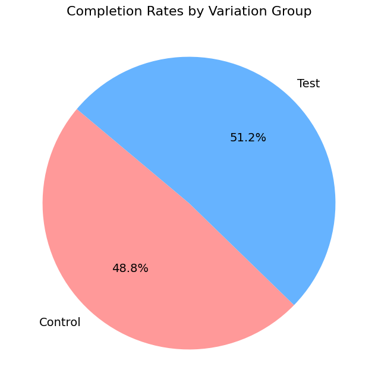
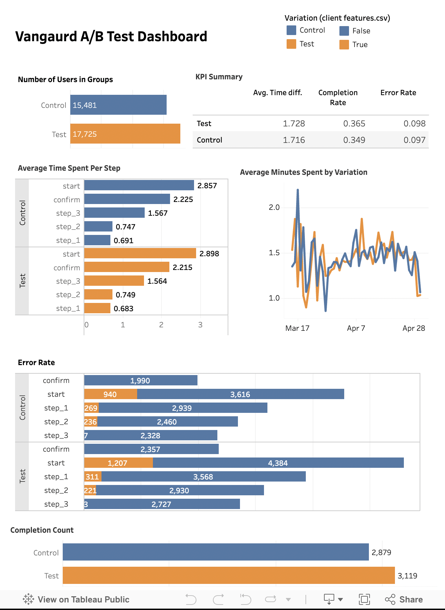

# Project 2: Vanguard CX Digital Experiment Analysis

## Table of Contents
- [Project Brief](#project-brief)
  - [Context](#context)
  - [The Digital Challenge](#the-digital-challenge)
  - [The Experiment Conducted](#the-experiment-conducted)
  - [AB Testing](#ab-testing)
- [Getting Started](#getting-started)
  - [Datasets](#datasets)
  - [Sample Data](#sample-data)
  - [Data Cleaning Process](#data-cleaning-process)
  - [Figures and Analysis](#figures-and-analysis)
  - [Prerequisites](#prerequisites)
  - [Installation](#installation)
- [Usage](#usage)
- [Project Structure](#project-structure)
- [Contributing](#contributing)
- [License](#license)
- [Related Links](#Related-Links)
- [Acknowledgments](#acknowledgments)


## Project Brief

### Context
You are a newly employed data analyst in the Customer Experience (CX) team at Vanguard, the US-based investment management company. You’ve been thrown straight into the deep end with your first task. Before your arrival, the team launched an exciting digital experiment, and now, they’re eagerly waiting to uncover the results and need your help!

### The Digital Challenge
The digital world is evolving, and so are Vanguard’s clients. Vanguard believed that a more intuitive and modern User Interface (UI), coupled with timely in-context prompts (cues, messages, hints, or instructions provided to users directly within the context of their current task or action), could make the online process smoother for clients. The critical question was: Would these changes encourage more clients to complete the process?

### The Experiment Conducted
An A/B test was set into motion from 3/15/2017 to 6/20/2017 by the team.

- **Control Group**: Clients interacted with Vanguard’s traditional online process.
- **Test Group**: Clients experienced the new, spruced-up digital interface.

Both groups navigated through an identical process sequence: an initial page, three subsequent steps, and finally, a confirmation page signaling process completion.

The goal is to see if the new design leads to a better user experience and higher process completion rates.

### AB Testing
Note: Review what A/B testing is [here](https://www.optimizely.com/optimization-glossary/ab-testing/) if you are not already aware of how it works.

## Getting Started
# Dataset Cleaning Project

This repository contains the code and dataset used for cleaning a web log dataset. The dataset consists of web visit logs with several attributes related to user activity on a website.

## Dataset


1. **Web Data**
   - **Files:** `df_final_web_data_pt_1.txt` and `df_final_web_data_pt_2.txt`
   - **Columns:**
     - `client_id`: Unique identifier for each client.
     - `visitor_id`: Unique identifier for each visitor session.
     - `visit_id`: Unique identifier for each visit.
     - `process_step`: The step of the process the client is currently on.
     - `date_time`: Timestamp of when the process step occurred.

2. **Demographic Data**
   - **File:** `df_final_demo.txt`
   - **Columns:**
     - `client_id`: Unique identifier for each client.
     - `age`: Age of the client.
     - `gender`: Gender of the client.
     - `income_level`: Income level of the client.

3. **Experiment Clients Data**
   - **File:** `df_final_experiment_clients.txt`
   - **Columns:**
     - `client_id`: Unique identifier for each client.
     - `group`: Experimental group (control or test) to which the client belongs.

### Sample Data

#### Web Data Sample
| client_id | visitor_id | visit_id | process_step | date_time           |
|-----------|-------------|----------|--------------|---------------------|
| 9988021   | 580560515_7732621733 | 781255054_21935453173_531117 | step_3  | 2017-04-17 15:27:07 |
| 9988021   | 580560515_7732621733 | 781255054_21935453173_531117 | step_2  | 2017-04-17 15:26:51 |

#### Demographic Data Sample
| client_id | age | gender | income_level |
|-----------|-----|--------|--------------|
| 9988021   | 34  | Female | High         |
| 9988022   | 45  | Male   | Medium       |

#### Experiment Clients Data Sample
| client_id | group  |
|-----------|--------|
| 9988021   | test   |
| 9988022   | control|


## Data Cleaning Process

The data cleaning process was performed in a Jupyter Notebook (`Dataset_pt_Cleaning.ipynb`) and involved the following steps:

1. **Remove Duplicates**
2. **Check for Missing Values**
3. **Convert Data Types**
4. **Normalize Data**
5. **Analyze Categories in process_step**


### Figures and Analysis
- **Figure 1:** Distribution of clients across different process steps.

- **Figure 2:** Comparison of completion rates between the control and test groups.

- **Figure 3:** Comparison of error rates between the control and test groups.

- **Figure 4:** Tableau Dashboard Fig.


========================================================
### Prerequisites
- Python 3.x
- Jupyter Notebook
- Pandas
- NumPy
- Matplotlib / Seaborn (for data visualization)

### Installation
1. Clone the repository:
    ```sh
    git clone https://github.com/your-username/vanguard-ab-test.git
    ```
2. Navigate to the project directory:
    ```sh
    cd vanguard-ab-test
    ```
3. Install the required packages:
    ```sh
    pip install -r requirements.txt
    ```

## Usage
1. Open the Jupyter Notebook:
    ```sh
    jupyter notebook
    ```
2. Open the notebook file `main.ipynb` and run through the cells to see the analysis.

## Project Structure
- `Data/`: Contains the dataset used for the analysis.
- `Notebooks/`: Jupyter Notebooks with detailed analysis.
- `Figures/`: Contains the figures.
- `README.md`: Project documentation.

## Contributing
1. Fork the repository.
2. Create your feature branch:
    ```sh
    git checkout -b feature/YourFeature
    ```
3. Commit your changes:
    ```sh
    git commit -m 'Add some feature'
    ```
4. Push to the branch:
    ```sh
    git push origin feature/YourFeature
    ```
5. Open a pull request.

## License
This project is licensed under the [Ironhack](https://www.ironhack.com/de-en).

## Related-Links 
- Project Presentation [Google Slides](https://docs.google.com/presentation/d/1D125JABvQOq5Ml4LJuE25bdqN9AF4WwXFIq7IBKqd6c/edit#slide=id.p1)
- Tableau [Tableua](https://public.tableau.com/app/profile/faheem.khan3709/viz/Working_17224279398980/Dashboard1?publish=yes)
- Streamlit [Streamlit]()

## Acknowledgments
- Mahshid Khatami [linkedin](https://www.linkedin.com/in/mahshidkhatami-data-analyst)
- Faheem Khan [linkedin](https://https://www.linkedin.com/in/faheem-j-khan-1b9ba19a/)

